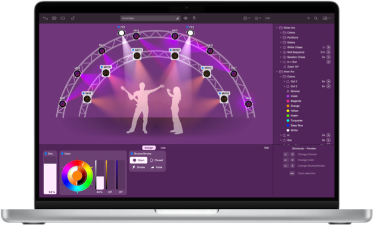

# Lightkey Software

---

The Lightkey software is a powerful lighting control solution that allows you to create stunning lighting designs and control your lighting fixtures with ease. Whether you're a professional lighting designer or a beginner, Lightkey provides intuitive tools and a user-friendly interface to bring your lighting vision to life.

## Installation
To install Lightkey, follow these steps:

1. Download the Lightkey installer from the [Lightkey website](https://www.lightkeyapp.com).
2. Run the installer and follow the on-screen instructions.
3. Launch the Lightkey software once the installation is complete.

## Getting Started
Before you begin using Lightkey, it's recommended to familiarize yourself with the basic concepts and features. The Lightkey user manual provides comprehensive information and step-by-step tutorials to help you get started quickly. You can access the manual at any time from within the Lightkey software.

To access the user manual:

1. Open Lightkey and click on the "Help" menu.
2. Select "User Manual" to open the manual in your default PDF viewer.

## System Requirements
Make sure your computer is running macOS big sur or above.

## Troubleshooting

One Other error I have run into is with the KingDMX interfaces. In order to get these interfaces to work with these requires you to download the kingDMX macOS app, and change the universe.

The DMXKing Control software can be found here: [DMXKING](https://dmxking.com/control-software)

