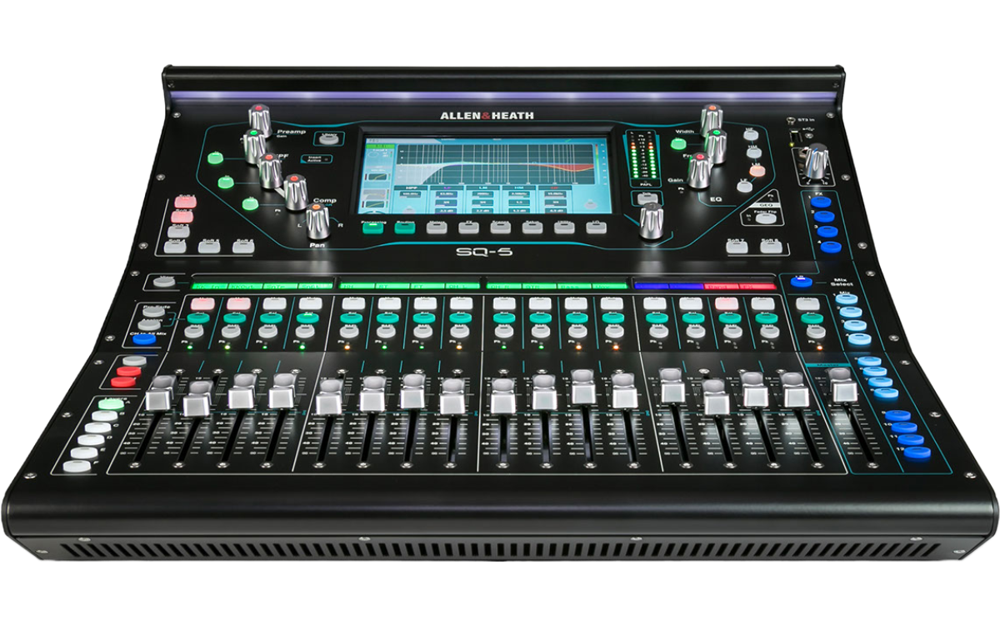

# Mixer: SQ-5

---
Centenial will mainly rely on the Allen & Heath SQ-5 mixer, which is a digital console that offers 48 input channels, 16 onboard preamps, and 17 faders. The SQ-5 mixer allows the mixer to adjust the sound levels, equalization, effects, and routing of the audio signals with ease and precision.

To Learn how to mix well I would reccomend looking at the resources in the following steps.

To jump into using the SQ-5, check out the [SQ-5 Quick Start Guide](SQ-5_Quick_Start_Guide.pdf). This guide will help you get started with the mixer and will help you understand the basic functions of the mixer.

After that, I would reccomend this video to get a better understanding of the mixer and how to use it. [Allen & Heath SQ-5 Tutorial](https://youtu.be/wSR4AUP3kjU)

After that, I would reccomend watching this offical Allen & Heath playlist on YouTube. [SQ-5 Training Videos](https://youtu.be/u1WkHNs52NI)

---
Here are backups to the manuals
- [Crown XTi2 Series Operation Manual](XTi2SeriesOperation.pdf)
- [Crown XTi Amplifier Information](XTi_Information.pdf)

Here are backups to the software

